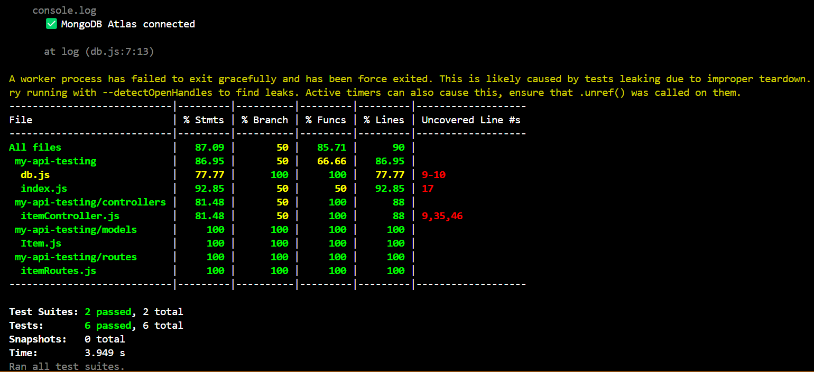

# 📦 My API Testing Project

This is a basic **Node.js + Express** REST API with full **CRUD operations** using **MongoDB Atlas** as the database. It includes **unit tests**, **integration tests**, and **API tests** with high test coverage using **Jest** and **Supertest**.

---

## 🔗 API You Integrated

This API allows managing a collection of items (e.g., a simple "to-do" or inventory list).

### Base URL

```
http://localhost:5000
```

### Endpoints

| Method | Endpoint             | Description             |
|--------|----------------------|-------------------------|
| GET    | `/items`             | Get all items           |
| POST   | `/items`             | Add a new item          |
| PUT    | `/items/:id`         | Update an existing item |
| DELETE | `/items/:id`         | Delete an item          |

---

## 🧰 Tech Stack Used

- **Node.js**
- **Express.js**
- **MongoDB Atlas**
- **Mongoose**
- **dotenv**
- **Jest** (unit testing)
- **Supertest** (integration/API testing)
- **Nodemon**

---

## ▶️ How to Run the Application

### 1. Clone the Repository

```bash
git clone https://github.com/your-username/my-api-testing.git
cd my-api-testing
```

### 2. Install Dependencies

```bash
npm install
```

### 3. Setup Environment Variables

Create a `.env` file in the root folder and add your MongoDB Atlas URI:

```
MONGO_URI=your_mongo_uri_here
```

### 4. Run the Application

```bash
npm start
```

Server will run on:  
```
http://localhost:5000
```

---

## 🧪 How to Run Tests

This will run all unit, integration, and API tests and show test coverage:

```bash
npm test
```

---

## 🧪 Testing Tools Used

| Type              | Tool        |
|-------------------|-------------|
| Unit Testing      | Jest        |
| Integration/API   | Supertest   |
| Test Coverage     | Jest CLI    |

---

## 📊 Test Coverage Report

```bash
> my-api-testing@1.0.0 test
> jest --coverage

 PASS  tests/itemController.test.js                                                                                                         
 PASS  tests/api.test.js

  ● Console

    console.log
      Server running on http://localhost:5000

      at Server.log (index.js:25:11)

    console.log
      ✅ MongoDB Atlas connected

      at log (db.js:7:13)

A worker process has failed to exit gracefully and has been force exited. This is likely caused by tests leaking due to improper teardown. Try running with --detectOpenHandles to find leaks.

----------------------------|---------|----------|---------|---------|-------------------
File                        | % Stmts | % Branch | % Funcs | % Lines | Uncovered Line #s 
----------------------------|---------|----------|---------|---------|-------------------
All files                   |   87.09 |       50 |   85.71 |      90 |                   
 my-api-testing             |   86.95 |       50 |   66.66 |   86.95 |                   
  db.js                     |   77.77 |      100 |     100 |   77.77 | 9-10              
  index.js                  |   92.85 |       50 |      50 |   92.85 | 17                
 my-api-testing/controllers |   81.48 |       50 |     100 |      88 |                   
  itemController.js         |   81.48 |       50 |     100 |      88 | 9,35,46           
 my-api-testing/models      |     100 |      100 |     100 |     100 |                   
  Item.js                   |     100 |      100 |     100 |     100 |                   
 my-api-testing/routes      |     100 |      100 |     100 |     100 |                   
  itemRoutes.js             |     100 |      100 |     100 |     100 |                   
----------------------------|---------|----------|---------|---------|-------------------

Test Suites: 2 passed, 2 total  
Tests:       6 passed, 6 total  
Snapshots:   0 total  
Time:        3.949 s  
Ran all test suites.
```

---

## 📸 Screenshot of Coverage Output



---

## 👨‍💻 Author

**Aditya Bahadur**  
KIIT University — B.Tech CSE, 3rd Year  
GitHub: [https://github.com/adityabahadur](https://github.com/adityabahadur)

---
